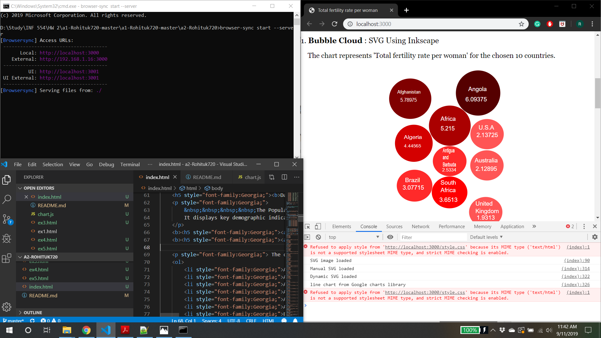

# INF 554 Assignment 2

Update this README as needed.
Name:Rohit Kulkarni
USC ID:5402749044
Email ID:rohitkul@usc.edu

<a href="http://data.un.org/Data.aspx?d=PopDiv&f=variableID%3a54">Dataset link</a>
<a href="https://docs.google.com/spreadsheets/d/1Xv2pQFHU7bfutvClViUta63e35mwSDakz6bU7UDaZJo/edit#gid=243334822">Google spreadsheet link</a>

The countries considered for this analysis is as follows:

    <ol>
        <li>Afghanistan</li>
        <li>Africa</li>
        <li>Algeria</li>
        <li>Angola</li>
        <li>Antigua and Barbuda</li>
        <li>Australia</li>
        <li>Brazil</li>
        <li>South Africa</li>
        <li>United Kingdom</li>
        <li>United States of America</li>
    </ol>

## Description of three charts: 
<u>1. Bubble Cloud : Create prototype using Inkscape</u>

        - Create circle for each of the 10 countries with their radius proportional to the fertility rate of the country
        - Save this svg file in the github folder and embed it as an image in index.html

<u>2. Bubble Cloud : Recreate with SVG elements in index.html</u>

        - Create circle and text elements within svg tags
        - Include attributes such as cx,cy,rx,ry fill for circle elements
        - Inclue x,y co-ordinates,fill color and style tags for text elements
        - Create style.css and include common styling properties in this file

<u>3. Bubble Cloud : Dynamic SVG using Javascript</u>

        - Create chart.js and create circles and text tags in this file

Sample javascript code:

var ellipse1 = document.createElementNS("http://www.w3.org/2000/svg", "ellipse"); 
ellipse1.setAttribute("cx", 38.21954); 
ellipse1.setAttribute("cy", 57.259224); 
ellipse1.setAttribute("rx", 37.685005); 
ellipse1.setAttribute("ry", 36.081387); 
ellipse1.setAttribute("fill", "#800000"); 
svg.appendChild(ellipse1); 

var text1 = document.createElementNS("http://www.w3.org/2000/svg", "text"); 
text1.setAttribute("x", 15.784807); 
text1.setAttribute("y", 46.262638); 
text1.setAttribute("font-size", "8.10793781px") 
text1.setAttribute("fill","#ffffff") 
text1.innerHTML = "Afghanistan"; 
svg.appendChild(text1); 

<u>4. Line chart created using Google charts library</u>

    Created Google Charts by populating the data table and drawing the chart using that data.
    Note the use of the curveType: none option. The chart displays tooltips when hovering over points.

<b>Note: Node js Browser sync is used for this assignment.</b>

