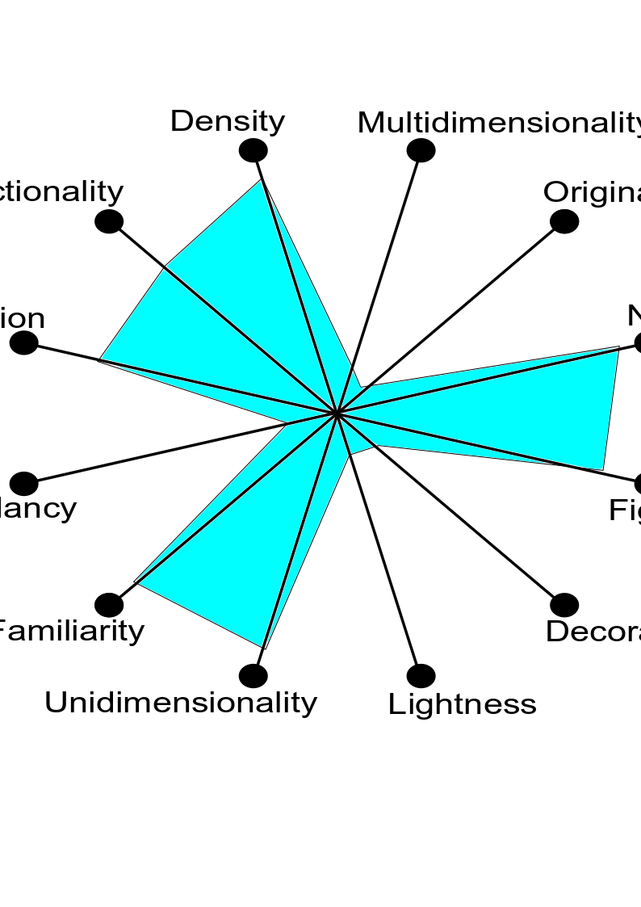

# INF 554 Assignment 3

Name: Rohit Kulkarni
USC ID: 5402749044

    &nbsp;&nbsp;&nbsp;&nbsp;What Happens in One Internet Minute? 
    &nbsp;&nbsp;&nbsp;&nbsp;During one minute, there are 87,500 people tweeting on Twitter, 347,222 people scrolling on Instagram, and 1.4 million people looking for love on Tinder. At the same time, 2.1 million Snaps are snapped on Snap, 41.6 million &nbsp;&nbsp;&nbsp;&nbsp;messages are sent on Facebook Messenger and WhatsApp, and 4.8 million GIFs are served by GIPHY.
    It’s also surprising to hear that 694,444 hours are watched on Netflix every minute, while $996,956 are spent online. 

<u> Choose two Infographics on the topic 'What Happens in One Internet Minute' </u>

- Infographic 1: 
  - 
<a href="https://www.domo.com/blog/data-never-sleeps-4-0/">Source</a>

  - 
<a href="https://web-assets.domo.com/blog/wp-content/uploads/2016/06/16-blog-featured-675x400.jpg">Infographic</a>

- Infographic 2: 
  - 
<a href="https://www.pinterest.com.au/pin/295971006734674221/?autologin=true">Source</a>

  - 
<a href="https://i.pinimg.com/originals/24/10/c2/2410c2e93479ebb77994fcc357ecd14d.jpg">Infographic</a>

<u>2. Build Visualization Wheels using Inkscape</u>

 - Visualization Wheel: 
  
  

  
 
  

  
 
 
 - Different aspects/measures used to create the Visualization Wheel: 
  
   

  
   
    

<u>3. Provided Analysis of both the Infographics  based on Visualization wheel</u> 
 - Positives
 - Negatives
 - Improvements  