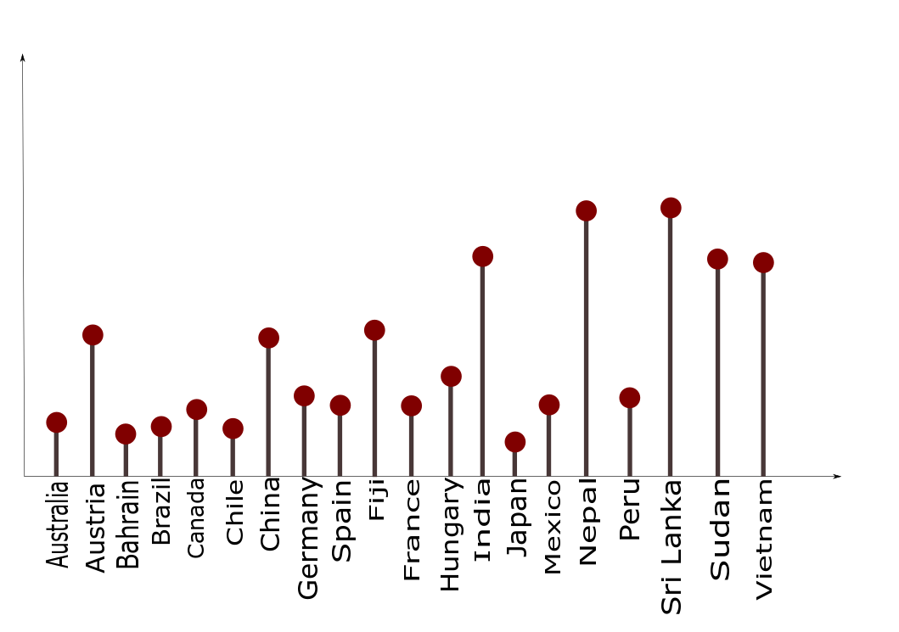
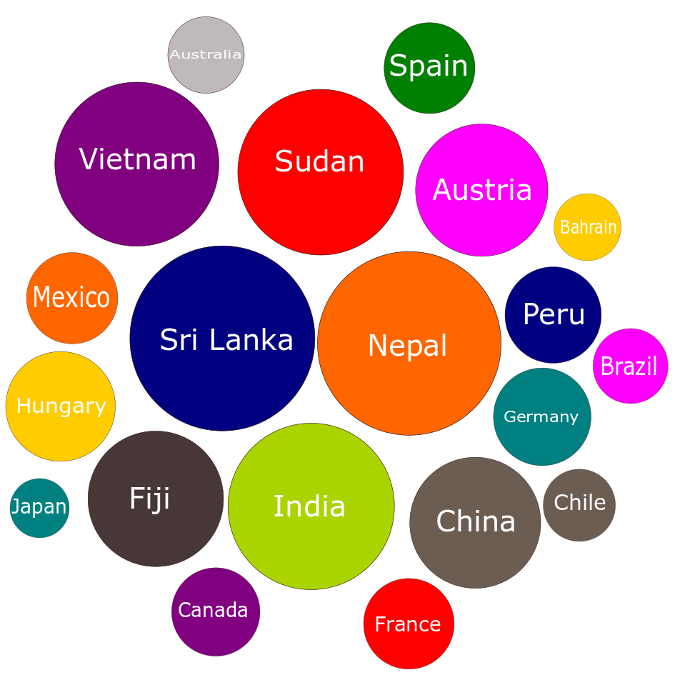

# INF 554 Assignment 4

<p>
    &nbsp;&nbsp;&nbsp;&nbsp; World Bank staff estimates based on the United Nations Population Division's World Urbanization Prospects. The Rural population percentage of 20 countries as of the year 2018 is visualized using four different visualization techniques.
 </p>
<p><a href="https://data.worldbank.org/indicator/SP.RUR.TOTL.ZS">Dataset link</a></p>

<p> The countries considered for this analysis is as follows:</p>
<ol>

<li>Australia</li>
<li>Austria</li>
<li>Bahrain</li>
<li>Brazil</li>
<li>Canada</li>
<li>Chile</li>
<li>China</li>
<li>Germany</li>
<li>Spain</li>
<li>Fiji</li>
<li>France</li>
<li>Hungary</li>
<li>India</li>
<li>Japan</li>
<li>Mexico</li>
<li>Nepal</li>
<li>Peru</li>
<li>Sri Lanka</li>
<li>Sudan</li>
<li>Vietnam</li>
</ol>


## Charts created using Inkscape 
<u>1. Bar Chart: View of Rural Population (% of total population) in 2018 for each of the 20 countries</u>


<u>2. Lollipop Chart: View of Rural Population (% of total population) in 2018 for each of the 20 countries</u>


<u>3. Bubble Chart: View of Rural Population (% of total population) in 2018 for each of the 20 countries</u>


## Description of four charts: 
<u>1. HTML Table: View of Rural Population (% of total population) in 2018 for each of the 20 countries</u>

        - Create a table with columns such as Country Name and Rural population percentage for the year 2018
        

```html
    var table = d3.select('#table1');
    table.append("thead").append('tr')
    .selectAll('th')
    .data(columns)
    .enter()
    .append('th')
    .text(function(d){ return d})
    table.append("tbody").selectAll('tr')
    .data(data)
    .enter()
    .append('tr')
    .selectAll('td')
    .data(function(d) { return d; })
    .enter()
    .append('td')
    .text(function(d) { return d; });
    return table;
```

<u> 2. Bar Chart: View of Rural Population (% of total population) in 2018 for each of the 20 countries</u>

        - Create a bar chart with x-axis as countries and y-axis as Percentage of Rural Population.
        

```html
var svg = d3.select("svg.bar-chart");
    var pr = property(svg, data);
    var g = pr[0];
    var x = pr[1];
    var y = pr[2];

    g.selectAll(".bar")
    .data(data)
    .enter().append("rect")
    .style("text-align", "center")
    .attr("class", "bar")
    .attr("x", function(d) { return x(d[0]); })
    .attr("y", function(d) { return y(d[1]); })
    .attr("width", x.bandwidth())
    .attr("height", function(d) { return height - y(d[1]); })
    .text(function (d) { return y(d[1]); });
```
 
<u>3. Lollipop Chart: View of Rural Population (% of total population) in 2018 for each of the 20 countries</u>


```html
    var svg = d3.select("svg.lollipop-chart");
    var pr = property(svg, data);
    var g = pr[0];
    var x = pr[1];
    var y = pr[2];
    g.selectAll("svg")
    .data(data)
    .enter()
    .append("line")
    .attr("x1", function(d) { return x(d[0])+16; })
    .attr("y1", function(d) { return y(d[1]); })
    .attr("x2", function(d) { return x(d[0])+16; })
    .attr("y2", 386)
    .attr("stroke","#483737ff")
    .attr("stroke-width","6px")

    g.selectAll(".scatter")
    .data(data)
    .enter().append("circle")
    .attr("class", "scatter")
    .attr("cx", function(d) { return x(d[0])+16; })
    .attr("cy", function(d) { return y(d[1]); })
    .attr("r", 9)
```

<u>4. Bubble Chart: View of Rural Population (% of total population) in 2018 for each of the 20 countries</u>


```html
  var svg = d3.select("svg.bubble-chart");
    var hierarchy_data = {
        "children": data
    }
    
    var margin = 20;

    var width = svg.attr("width") -  margin;
    var height = svg.attr("height") - margin;

    var pack = d3.pack(hierarchy_data)
        .size([width, height])
        .padding(1.5);
    var color = d3.scaleOrdinal(d3.schemeCategory10);

    var nodes = d3.hierarchy(hierarchy_data)
        .sum(function (d) {
            return d[1];
        }).sort(function(a,b) {
       
            return b.data[1] - a.data[1];
        })

    var node = svg.selectAll(".node")
        .data(pack(nodes).descendants())
        .enter()
        .filter(function (d) {
            return !d.children;
        })
        .append("g")
        .attr("class", "node")
        .attr("transform", function (d) {
                
                return  "translate(" + d.x+ "," + d.y+ ")";
        })

    
    node.append("circle")
        .attr("r", function (d) {
            return d.r*1;
        }).style("fill", function (d, i) {
            return color(i);
        });
    

    node.append("text")
        .text(function(d) {
            return d.data[0]
        })
        .attr("text-anchor", "middle")
        .attr('fill','white')


