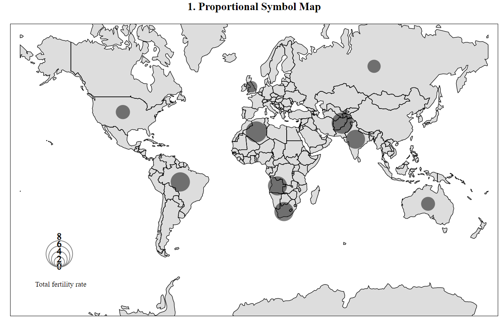
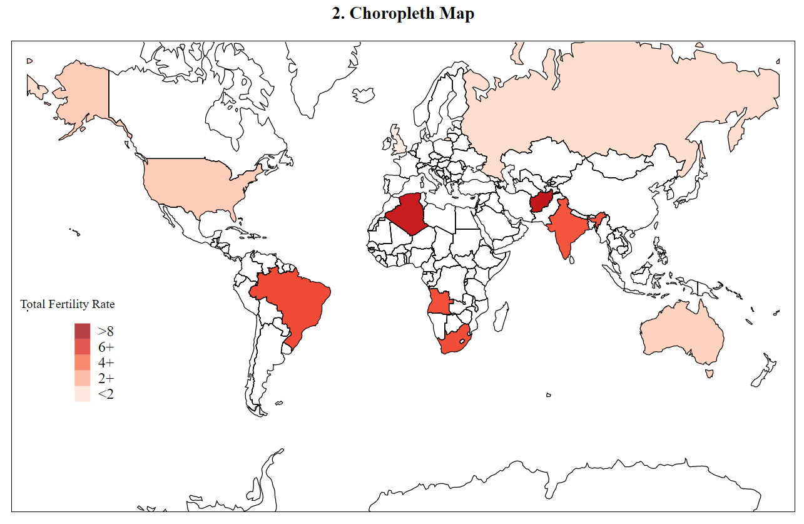
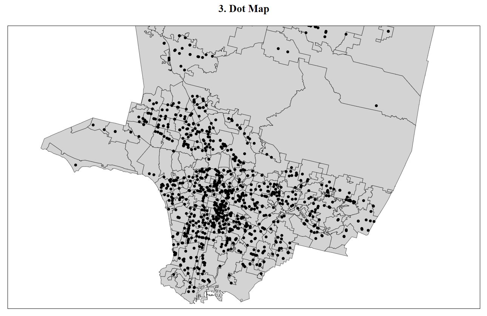

# INF 554 Assignment 9

## Lab 9

1. Ex1 - Added USC Lat,long and What's here and added H1N1 USA Map by confirmed deaths.svg - http://pdms.usc.edu/~rohitkul/a9/ex1.html
2. Ex2 - Implemented Mapbox GL and greyed the map - http://pdms.usc.edu/~rohitkul/a9/ex2.html
3. Ex3 - Implemented Leaflet and applied Stamer Watercolor - http://pdms.usc.edu/~rohitkul/a9/ex3.html
4. Ex4 - Implemented ex4-starter.html and colored California yellow and drew a dot at USC - http://pdms.usc.edu/~rohitkul/a9/ex4.html
5. Ex5 - Implemented Block 4090848 and set color to Smoke White - http://pdms.usc.edu/~rohitkul/a9/ex5.html
6. Ex6 Implemented Bubble map - http://pdms.usc.edu/~rohitkul/a9/ex6.html
7. Ex7 - Implemented Chorepleth map - http://pdms.usc.edu/~rohitkul/a9/ex7.html
8. Ex8 - Downloaded “City Boundaries” GeoJSON and set the projection to use d3.geoMercator() - http://pdms.usc.edu/~rohitkul/a9/ex8.html

## Assignment 9

<h1 style="text-align: center">Total fertility rate (live births per woman)</h1>

<b> <u>Dataset Description</u></b>: The Population Division of the Department of Economic and Social Affairs of the United Nations Secretariat prepared the 2019 Revision of World Population Prospects representing the latest global set of demographic estimates and projections. It displays key demographic indicators for selected periods or dates from 1950-1955, for the countries or areas with more than 90,000 inhabitants in 2019.   

<b>1. Proportional Symbol Map:</b> Bubble size is proportional to the Total Fertility rate, More information can be viewed by hovering on the countries' bubbles. 

<b>2. Choropleth Map:</b> Color density is proportional to the Total Fertility rate, More information can be viewed by hovering on the countries. 

<b>3. Dot Map:</b> This Map shows the locations of around 1000 Food markets in LA County.

<a href="http://data.un.org/Data.aspx?d=PopDiv&f=variableID%3a54">Click here to view Total Fertility Data</a>

<a href="https://data.lacounty.gov">Click here to view LA County Food Markets Data</a>

    

The countries considered for this analysis is as follows:

    <ol>
        <li style="font-family:Georgia;font-size: 18px">Afghanistan</li>
        <li style="font-family:Georgia;font-size: 18px">Australia</li>
        <li style="font-family:Georgia;font-size: 18px">Brazil</li>
        <li style="font-family:Georgia;font-size: 18px">India</li>
        <li style="font-family:Georgia;font-size: 18px">Algeria</li>
        <li style="font-family:Georgia;font-size: 18px">Angola</li>
        <li style="font-family:Georgia;font-size: 18px">South Africa</li>
        <li style="font-family:Georgia;font-size: 18px">United States of America</li>
        <li style="font-family:Georgia;font-size: 18px">United Kingdom</li>
        <li style="font-family:Georgia;font-size: 18px">Russia</li>
    </ol>

Development Setup
1. world.json has the world's geo data.
2. la.json has Los Angeles county's geo data.
3. There are 3 separate javascript files for Choropleth, Proportional symbol and Dot map.
4. markets.csv has details of te food markets in Los Angeles county.
5. data.csv has the information of 10 countries and their rural population percentage in 2010.
6. The concepts used in this assignment includes topojson, geojson, npm node modules, D3 version 5, svg.

Published HTML Page : http://pdms.usc.edu/~rohitkul/a9/